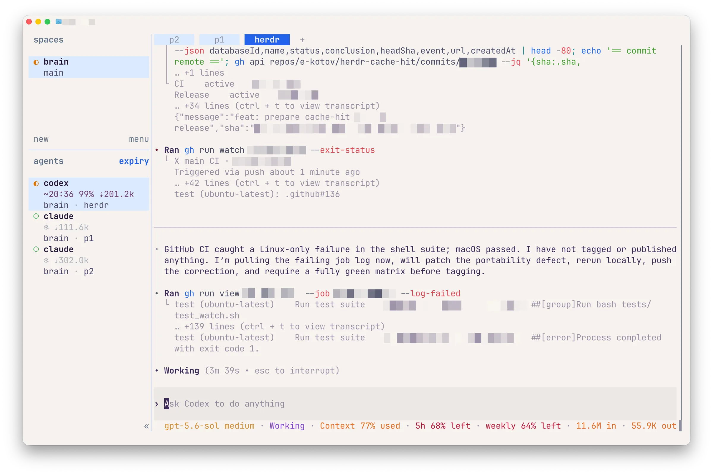

::: {.hero}
::: {.eyebrow}
Herdr plugin · v0.1.1
:::

# Keep the warm context warm.

`cache-hit` gives [Herdr](https://github.com/herdrdev/herdr) a quiet, real-time view of prompt-cache health: hit ratios, retained tokens, expiration countdowns, and deadline-aware agent sorting.

::: {.hero-actions}
[Install the plugin](#install){.button .button-primary} [View on GitHub](https://github.com/e-kotov/herdr-cache-hit){.button .button-secondary}
:::

Works locally with Codex CLI, Claude Code, OpenCode, and AGY on macOS and Linux.
:::

::: {.story-intro .column-body}
## Read the cache at a glance

One compact sidebar answers the question that matters before you switch agents: which context is still reusable, and which one needs attention now?
:::

:::: {.desktop-story .cr-section layout="sidebar-left"}

::: {.story-step focus-on="cr-cache-ui" scale-by="1" pan-to="0%,0%"}
### Active context, without the noise

The active Codex pane shows its estimated expiry time, cache-hit percentage, and retained read tokens in one line.
:::

::: {.story-step focus-on="cr-cache-ui" scale-by="1.7" pan-to="31%,0%"}
### Cold means cold

After expiry, stale percentages disappear. The `❄ ⇣tokens` state keeps the useful retained-token history without implying that the cache is still available.
:::

::: {.story-step focus-on="cr-cache-ui" scale-by="1.7" pan-to="31%,18%"}
### Work the deadline, not the list

The `expiry` view sorts active panes by `cache_deadline`, moving the most urgent context to the top. Toggle it with `prefix+s`; return to native order the same way.
:::

:::{#cr-cache-ui .screenshot-sticky}

:::

::::

::: {.mobile-story}


The sidebar distinguishes active cache metrics from the cold `❄ ⇣tokens` state and can sort panes by the nearest expiry.
:::

::: {.features}
## Small surface, useful signals

::: {.feature-grid}
::: {.feature-card}
### Live cache health

Event hooks update immediately, while one bounded wake timer keeps active countdowns current. Cold installations schedule no periodic work.
:::

::: {.feature-card}
### Honest state transitions

Healthy, urgent, and cold states use distinct symbols and colors. Expired percentages are cleared because they no longer describe reusable context.
:::

::: {.feature-card}
### Native Herdr controls

Declarative tokens and `cache_deadline` integrate with Herdr styling and sorting. There is no dashboard, account, analytics service, or network telemetry.
:::
:::

::: {.compatibility-shot}


One expiry-ordered view across AGY, Codex, and Claude panes.
:::

::: {.compatibility}
**Compatibility:** macOS and Linux; Windows through WSL2. `jq` and Bash are required. Python is needed only for OpenCode monitoring or view toggling; Go is needed only to build the optional AGY helper from source.
:::
:::

::: {#install .install}
## Install

```bash
git clone https://github.com/e-kotov/herdr-cache-hit.git
cd herdr-cache-hit
herdr plugin link .
```

::: {.install-links}
[User guide](https://github.com/e-kotov/herdr-cache-hit/blob/main/USERGUIDE.md) · [GitHub repository](https://github.com/e-kotov/herdr-cache-hit) · [Releases](https://github.com/e-kotov/herdr-cache-hit/releases) · [MIT license](https://github.com/e-kotov/herdr-cache-hit/blob/main/LICENSE)
:::
:::

::: {.site-footer}
`cache-hit` is an independent open-source plugin for Herdr. No analytics, external fonts, or executable notebook code are used on this page.
:::
