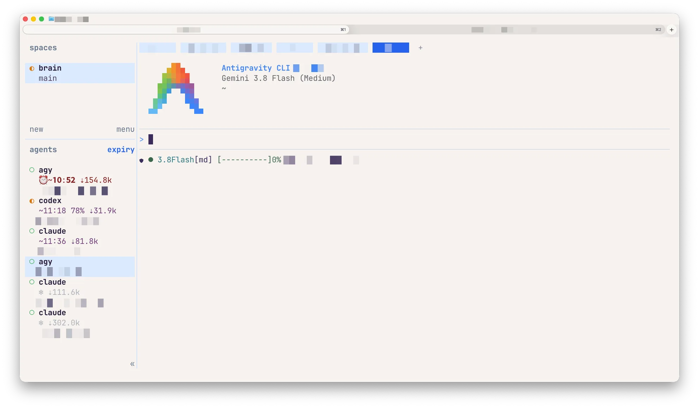

```{=html}
<nav class="site-nav column-screen" id="top" aria-label="Primary navigation" style="z-index: 2000 !important;">
  <div class="site-nav-inner">
    <a class="site-nav-brand" href="#top">
      <b>herdr</b><span class="plugin-pill">cache-hit</span>
    </a>
    <div class="site-nav-sp"></div>
    <div class="site-nav-links">
      <a class="nav-lnk" href="#features">Features</a>
      <a class="nav-ico wide" href="https://github.com/e-kotov/herdr-cache-hit" aria-label="cache-hit on GitHub — star count">
        <svg viewBox="0 0 16 16" aria-hidden="true"><path d="M8 0C3.58 0 0 3.58 0 8c0 3.54 2.29 6.53 5.47 7.59.4.07.55-.17.55-.38 0-.19-.01-.82-.01-1.49-2.01.37-2.53-.49-2.69-.94-.09-.23-.48-.94-.82-1.13-.28-.15-.68-.52-.01-.53.63-.01 1.08.58 1.23.82.72 1.21 1.87.87 2.33.66.07-.52.28-.87.51-1.07-1.78-.2-3.64-.89-3.64-3.95 0-.87.31-1.59.82-2.15-.08-.2-.36-1.02.08-2.12 0 0 .67-.21 2.2.82A7.64 7.64 0 0 1 8 3.87c.68 0 1.36.09 2 .26 1.53-1.04 2.2-.82 2.2-.82.44 1.1.16 1.92.08 2.12.51.56.82 1.27.82 2.15 0 3.07-1.87 3.75-3.65 3.95.29.25.54.73.54 1.48 0 1.07-.01 1.93-.01 2.2 0 .21.15.46.55.38A8.01 8.01 0 0 0 16 8c0-4.42-3.58-8-8-8Z"></path></svg>
        <b data-stars>0</b>
      </a>
      <a class="nav-btn" href="#install">Install</a>
    </div>
  </div>
</nav>
```

::: {.hero}
::: {.eyebrow}
Cache Hit plugin for [Herdr](https://herdr.dev/)
:::

# Keep the warm context warm.

`cache-hit` gives [Herdr](https://herdr.dev/) a real-time view of prompt-cache health: hit ratios, retained tokens, expiration countdowns, and deadline-aware agent sorting.

::: {.hero-actions}
[Install the plugin](#install){.button .button-primary} [View on GitHub](https://github.com/e-kotov/herdr-cache-hit){.button .button-secondary}
:::

Works locally with Codex CLI, Claude Code, OpenCode, and Antigravity CLI on macOS and Linux.
:::

::: {.story-intro .column-body}
## Features {#features}

One compact sidebar answers the question that matters before you switch agents: which context is still reusable, and which one needs attention now?
:::

:::: {.desktop-story .cr-section layout="sidebar-left"}

::: {.story-step .step-alarm focus-on="cr-cache-ui" scale-by="1.6" pan-to="28%,2%"}
### Alarm icon shows when cache is about to expire

When a cache is about to expire, the custom `expiry` sort view pushes its agent to the top. A configurable alarm icon appears, and the countdown becomes bolder.
:::

::: {.story-step .step-active focus-on="cr-cache-ui" scale-by="1.9" pan-to="34%,-10%"}
### Active caches show remaining time and retained tokens

Active agents show time to expiry, cache-hit percentage when available, and retained read tokens. The same indicators work across Antigravity CLI, Codex, and Claude.
:::

::: {.story-step .step-cold focus-on="cr-cache-ui" scale-by="1.9" pan-to="34%,-30%"}
### Cold caches keep token history, not stale percentages

After expiry, the percentage disappears. The `❄ ⇣tokens` state keeps retained-token history without implying that the cache is reusable.
:::

:::{#cr-cache-ui .screenshot-sticky}
::: {.screenshot-frame data-annotation="alarm"}

<span class="focus-rect annotation-alarm" aria-hidden="true"></span>
<span class="focus-rect annotation-active" aria-hidden="true"></span>
<span class="focus-rect annotation-cold" aria-hidden="true"></span>
:::
:::

::::

```{=html}
<script>
document.addEventListener("DOMContentLoaded", () => {
  const frame = document.querySelector("#cr-cache-ui .screenshot-frame");
  const steps = ["alarm", "active", "cold"]
    .map(name => ({ name, element: document.querySelector(`.step-${name}`)?.closest(".trigger") }))
    .filter(step => step.element);

  if (!frame || steps.length === 0) return;

  let scheduled = false;
  const updateAnnotation = () => {
    const midpoint = window.innerHeight / 2;
    const active = steps.reduce((nearest, step) => {
      const box = step.element.getBoundingClientRect();
      const distance = Math.abs(box.top + box.height / 2 - midpoint);
      return distance < nearest.distance ? { name: step.name, distance } : nearest;
    }, { name: steps[0].name, distance: Infinity });

    frame.dataset.annotation = active.name;
    scheduled = false;
  };

  const scheduleUpdate = () => {
    if (scheduled) return;
    scheduled = true;
    window.requestAnimationFrame(updateAnnotation);
  };

  window.addEventListener("scroll", scheduleUpdate, { passive: true });
  window.addEventListener("resize", scheduleUpdate);
  updateAnnotation();

  const copyButton = document.querySelector(".copy-install");
  const installCode = document.querySelector(".install-command code");
  copyButton?.addEventListener("click", async () => {
    const command = installCode.textContent.replace(/^\$ /gm, "").trim();
    try {
      await navigator.clipboard.writeText(command);
      copyButton.textContent = "Copied";
    } catch {
      const range = document.createRange();
      range.selectNodeContents(installCode);
      window.getSelection().removeAllRanges();
      window.getSelection().addRange(range);
      copyButton.textContent = "Press ⌘C";
    }
    window.setTimeout(() => { copyButton.textContent = "Copy"; }, 1600);
  });
});
</script>
```

::: {.mobile-story}
::: {.mobile-focus-card}
::: {.mobile-crop .crop-alarm}

:::

### Alarm icon shows when cache is about to expire

The `expiry` sort view pushes the agent to the top. A configurable alarm icon appears, and the countdown becomes bolder.
:::

::: {.mobile-focus-card}
::: {.mobile-crop .crop-active}

:::

### Active caches show remaining time and retained tokens

Active agents show time to expiry, cache-hit percentage when available, and retained read tokens.
:::

::: {.mobile-focus-card}
::: {.mobile-crop .crop-cold}

:::

### Cold caches keep token history, not stale percentages

After expiry, the percentage disappears. The `❄ ⇣tokens` state keeps retained-token history without implying that the cache is reusable.
:::
:::

::: {.features}
::: {.feature-grid}
::: {.feature-card}
### See active cache metrics

See time to expiry, cache-hit percentage when available, and retained read tokens. The values update while the cache is active.
:::

::: {.feature-card}
### Expired caches show as cold

When a cache expires, its percentage disappears. A snowflake and the retained-token count remain.
:::

::: {.feature-card}
### Put expiring caches first

Press `prefix+s` to put the cache closest to expiry at the top of the agents pane. Press it again to return to the default view.
:::
:::

::: {.compatibility}
**Compatibility:** macOS and Linux; Windows through WSL2. `jq` and Bash are required. Python is needed only for OpenCode monitoring or view toggling; Go is needed only to build the optional Antigravity CLI helper from source.
:::
:::

::: {.install}
::: {.install-inner}
## Install {#install}

```{=html}
<div class="install-card">
  <div class="install-card-header">
    <div class="install-card-label">Terminal</div>
    <button class="copy-install" type="button" aria-label="Copy install command">Copy</button>
  </div>
  <pre class="install-command"><code><span class="prompt">$</span> herdr plugin install e-kotov/herdr-cache-hit</code></pre>
</div>
```

::: {.install-links}
[User guide](https://github.com/e-kotov/herdr-cache-hit/blob/main/USERGUIDE.md) · [GitHub repository](https://github.com/e-kotov/herdr-cache-hit) · [Releases](https://github.com/e-kotov/herdr-cache-hit/releases) · [MIT license](https://github.com/e-kotov/herdr-cache-hit/blob/main/LICENSE)
:::
:::
:::

::: {.site-footer}
`cache-hit` is an open-source plugin for Herdr by [Egor Kotov](https://www.ekotov.pro).
:::

```{=html}
<script>
  (function () {
    fetch("https://api.github.com/repos/e-kotov/herdr-cache-hit", {
      headers: { Accept: "application/vnd.github.v3+json" }
    })
      .then(function (r) { return r.ok ? r.json() : null; })
      .then(function (d) {
        if (!d || typeof d.stargazers_count !== "number") return;
        var formatted = d.stargazers_count.toLocaleString();
        document.querySelectorAll("[data-stars]").forEach(function (el) {
          el.textContent = formatted;
        });
      })
      .catch(function () {});
  })();
</script>
```
